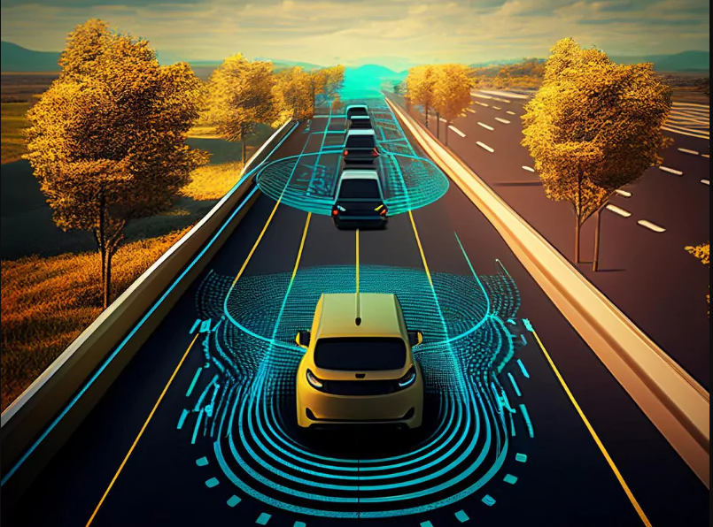
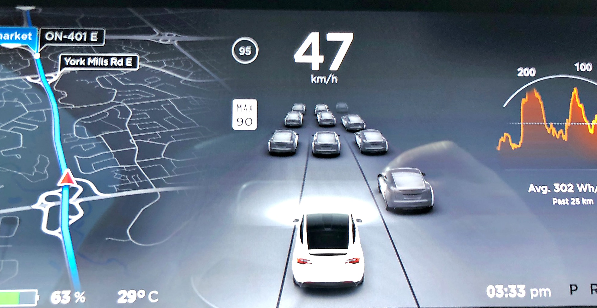
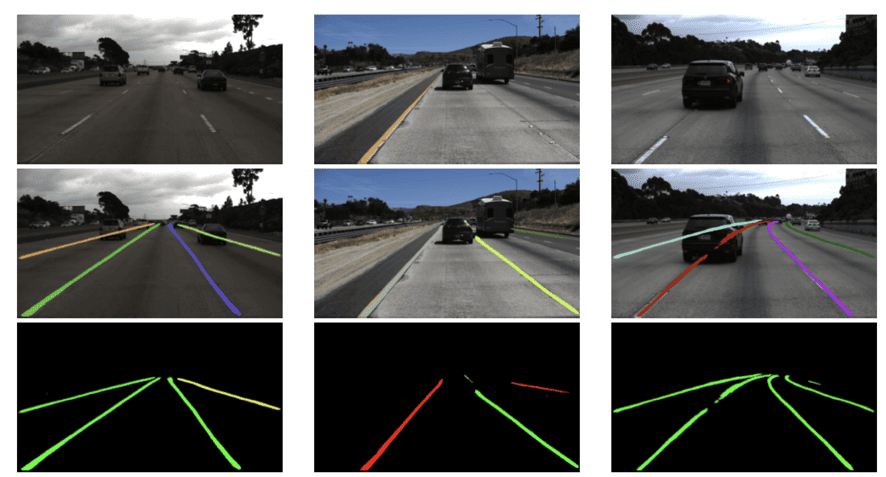
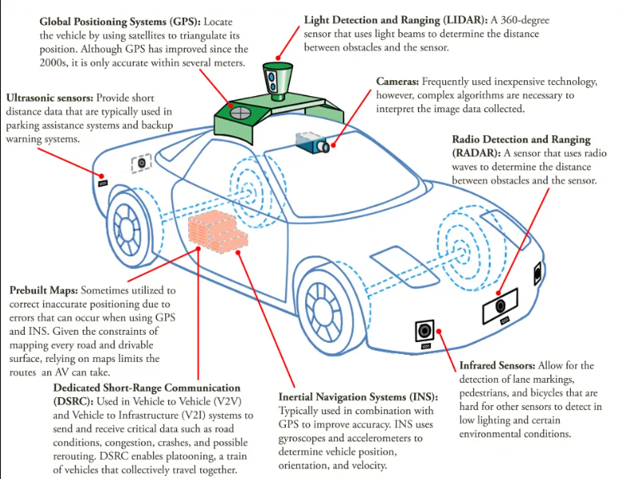

# 🚗✨ Lane_Detection_for_Autonomous_Vehicles and Video Comparison Tool
- Welcome to the Lane Detection and Video Comparison Tool! This repository features a sophisticated lane detection pipeline using OpenCV and a futuristic, user-friendly Tkinter GUI to compare input and processed videos side-by-side. Perfect for developers and researchers working on autonomous driving and advanced driver-assistance systems (ADAS).
<p align="center">

</p>

## 🌟 Features:
- 🔍 Lane Detection: Efficiently detect and highlight lane lines in video frames using advanced image processing techniques.
- 📹 Video Comparison: Display original and processed videos side-by-side for easy visual comparison.
- 📏 Curvature Calculation: Accurately calculate and display the curvature of detected lanes.
- ⏩ Speed Control: Adjust the playback speed of the video to analyze lane detection performance.
- 🌙 Dark Mode: Toggle dark mode for a comfortable viewing experience, especially in low-light environments.
- 🖥️ Interactive GUI: Sleek and user-friendly interface with various control options for a seamless experience.

## 🧠 How the project works:
                                                         +---------------------------+
                                                        | Start the Application     |
                                                        +-------------+-------------+
                                                                      |
                                                                      v
                                                        +---------------------------+
                                                        | Read Video Frame (Input)  |
                                                        +-------------+-------------+
                                                                      |
                                                                      v
                                                        +---------------------------+
                                                        | Convert to Grayscale      |
                                                        +-------------+-------------+
                                                                      |
                                                                      v
                                                        +---------------------------+
                                                        | Apply Gaussian Blur       |
                                                        +-------------+-------------+
                                                                      |
                                                                      v
                                                        +---------------------------+
                                                        | Detect Edges (Canny)      |
                                                        +-------------+-------------+
                                                                      |
                                                                      v
                                                        +---------------------------+
                                                        | Mask Region of Interest   |
                                                        +-------------+-------------+
                                                                      |
                                                                      v
                                                        +---------------------------+
                                                        | Detect Lane Lines (Hough) |
                                                        +-------------+-------------+
                                                                      |
                                                                      v
                                                        +---------------------------+
                                                        | Separate Left and Right   |
                                                        +-------------+-------------+
                                                                      |
                                                                      v
                                                        +---------------------------+
                                                        | Draw and Fill Lane Area   |
                                                        +-------------+-------------+
                                                                      |
                                                                      v
                                                        +---------------------------+
                                                        | Overlay on Original Frame |
                                                        +-------------+-------------+
                                                                      |
                                                                      v
                                                        +---------------------------+
                                                        | Display in GUI (Original  |
                                                        | vs Processed)             |
                                                        +-------------+-------------+
                                                                      |
                                                                      v
                                                        +---------------------------+
                                                        | End the Application       |
                                                        +---------------------------+

## 🚀 How big Tech like TESLA are incorporating this:
- Tesla's autonomous vehicles use a computer vision system called Tesla Vision to detect lane lines and other environmental variables. Tesla's Model 3 has cameras mounted on the front, rear, left, and right sides of the car to monitor the surrounding area. These cameras can detect road markings, obstacles, pedestrians, and other vehicles. Tesla's Vision system also uses Hydranets to only use what's needed by the system, and runs at least 50 neural networks simultaneously.
<p align="center">

</p>

##  ⚙ How the lane detection works: 
<p align="center">

</p>

## 📽️ Demo for lane detection on sample videos:


## 📽️ Demo for GUI showing comparison real-time: 


## 🚀 Installation:
### Clone the Repository

```bash
git clone https://github.com/yourusername/Lane_Detection_for_Autonomous_Vehicles.git
cd Lane_Detection_for_Autonomous_Vehicles
```
### Install Dependencies
```bash
pip install -r requirements.txt
```

## 🛠️ Usage
### Process a Video:
- Modify the input and output paths in the script to point to your video files.
- Run the lane detection script to generate the processed video.
### Launch the GUI
- Use the provided script to start the Tkinter GUI.
- The GUI will display the original and processed videos side-by-side for comparison.
- Use the control buttons to toggle information display, dark mode, and adjust the video playback speed.

## 📂 Project Structure
- lane_detection_scripts.ipynb: Contains the lane detection pipeline.
- gui_lane_detection.ipynb: Contains the Tkinter GUI implementation.
- requirements.txt: Lists all the dependencies required for the project.

## 🔮 Futuristic Use Cases
<p align="center">

</p>

- **Autonomous Vehicles**: Enhance self-driving algorithms by integrating robust lane detection.
- **Driver Assistance Systems**: Improve safety with real-time lane departure warnings.
- **Traffic Management**: Monitor and analyze road lane usage to optimize traffic flow.
- **Simulation and Training**: Use processed video data for training AI models and simulation.

## 🤝 Contributing
Contributions are welcome! Please fork this repository and submit a pull request with your improvements.

## 🌐 Futuristic Potential
- This project is still software based and can be incorporated with hardware(with help of IOT & other techs) to build something big!.Contributions are always welcome for that.

- 🚀 Happy lane detecting and safe driving!
